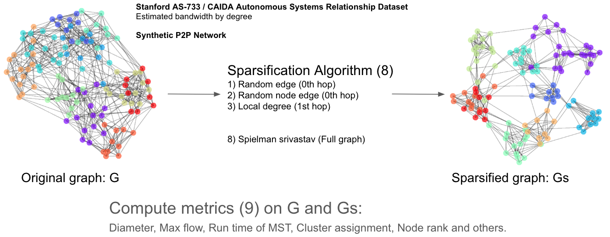
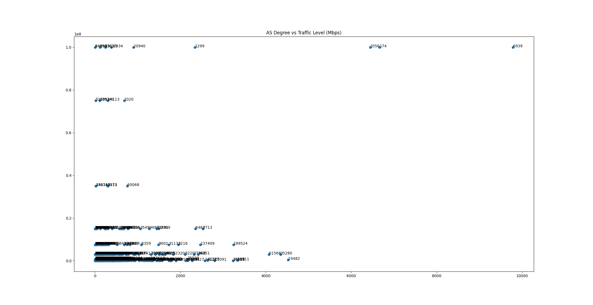

+++
title = "Improving Network Efficiency through Sparsification of Network Graphs"
date = 2022-12-09T00:00:00+00:00

[taxonomies]
tags = ["Post"]

[extra]
author = "Abhijeet, Dante, Deepak, Reed, and Zicheng"
+++

# Background

A computer network can be represented as an undirected graph, where switches and end hosts are nodes and connections enabling data transfer between them are edges. An autonomous system (AS) is a group of connected IP networks that are operated by a single entity, which consists of a lot of switches and end hosts. ASes are interconnected to enable communication between networks. As networks grow, there will be more switches and end hosts within autonomous systems with either wire or wireless connection, and more ASes are registered and interconnected with others with physical links.

Redundant links are sometimes introduced into the network to provide more bandwidth or robustness over failure, but this is pretty expensive and requires routers to have more resources to deal with routing information. We would like to see if we can identify important links in the network, and explore the potential of higher efficiency by using fewer redundant links.



# How?

We would like to use graph sparsification methods to remove edges from existing networks, and use various metrics to identify if the sparsified network graph:

- **Edge count**: Direct metric for measuring how aggressively sparsified a graph is.
- **Diameter**: Distance between the furthest pair of nodes, measured by assigning each edge a length of 1.
- **Node and edge connectivity**: The minimum number of nodes or edges whose removal is required to disconnect the graph. Measures redundancy.
- **Connectedness**: Whether each node is reachable from each other node.
- **Longest-shortest max flow**: how much data can be sent through it at any given time.
- **Average max flow**: While Longest-Shortest Max Flow measures worst-case bandwidth, this metric aims to capture average bandwidth.
- **PageRank**: The relative importance of different nodes in a graph by whether they have edges from other important nodes.
- **MST (Minimum spanning tree) runtime**: The time to perform Kruskal's algorithm on the graph.
- **Community structure**: Used Louvain community detection algorithm to identify small, densely connected clusters.

We've experimented with a lot of sparsification methods, both connectivity-preserving and non-connectivity-preserving:

- Spielman Srivastava
- Forest fire
- Local degree
- Local similarity
- Random edge
- Random node edge
- Spanner (preserves connectivity)
- Simmelian overlap

# What about datasets?

We would like to see the how graph sparsification methods work on a real network, so we mainly used two datasets:

- [CAIDA AS relationship graph](https://www.caida.org/catalog/datasets/as-relationships/): This is CAIDA's ongoing project since 1998 that measures the Internet's inter-domain structure.
- [Fat-tree](https://www.cs.cornell.edu/courses/cs5413/2014fa/lectures/08-fattree.pdf): A network topology used in data centers that scales well, with redundancy and high east-west traffic bandwidth.

Stanford's [AS-733](https://snap.stanford.edu/data/as-733.html) graph was also used during the testing phase.

## … And Bandwidth?

Bandwidth for fat-tree links should be pretty easy to estimate, but this is not the case for links between ASes. We initially plans to utilize [PeeringDB](https://www.peeringdb.com/)'s degree and traffic level to estimate the bandwidth (with some simple machine learning technique), but it turns out that the result is pretty inaccurate: 

- The type of business (Video Streaming / CDN) would affect the characteristic of traffic even if the nodes have the same degree;
- The dataset has only categorial data making methods like linear regression ineffective;
- The data from PeeringDB is not accurate/up-to-date and a lot of entities chose to not disclose their level of traffic, and abandoned AS also got mixed in.



We end up using degree directly to estimate the traffic of links. Nodes with higher degree indicate that they are likely higher-tier provider ASes, while low-degree nodes are likely low-tier ASes with low traffic level. The rule is described as follows: for AS **A** with degree **a** and AS **B** with degree **b**, the edge between **A** and **B** has `a < b ? a : b` bandwidth. However, this method also has some limitation: some Cloud / VPS provider may provide free peering with customers buying VPS service from them, and degree of this provider AS might be high while customers doesn't really generate a lot of traffic. This would make provider's AS has high degree, which may result in in accurate bandwidth estimation.

Python snippet for loading a graph and assign capacities:

```python
def load_net(file, assign_capacities=False):
    graph = None
    with open(file, 'r') as f:
        graph = nx.Graph()
        for line in f:
            if line.startswith('#'):
                continue

            if "|" in line:
                line = line.split("|")
            else:
                line = line.split()

            if line[0] != line[1]:
                graph.add_edge(int(line[0]), int(line[1]))

    if assign_capacities:
        node_deg = graph.degree()
        node_deg_dict = {}
        for node, deg in node_deg:
            node_deg_dict[node] = deg
        for u, v in graph.edges():
            u_deg = node_deg_dict[u]
            v_deg = node_deg_dict[v]
            graph.edges[u, v]['capacity'] = v_deg if u_deg > v_deg else u_deg

    return graph
```

# Some Interesting Findings


# Conclusions

In this study, we found that sparsification methods were able to significantly reduce the number of edges in computer networks. However, this reduction came at the expense of performance-critical metrics. Therefore, the development of sparsification methods that prioritize network performance could be beneficial for future research in this area. Of the methods tested, only spanner preserved connectedness. Methods that specifically avoid removing edges that represent essential connections or flow bottlenecks could improve upon the results of this work.

In future work, we plan to model the computer networks as directed graphs and conduct similar studies. This would be an interesting problem from a graph theory perspective, as the literature on sparsification algorithms for directed graphs is currently limited. Additionally, we plan to virtualize the networks studied here and simulate network traffic to gain a better understanding of the impact of sparsification in real-world scenarios.
